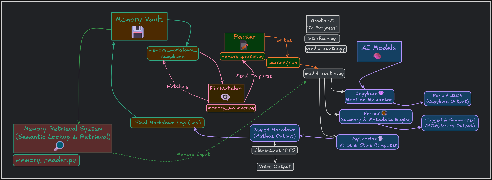
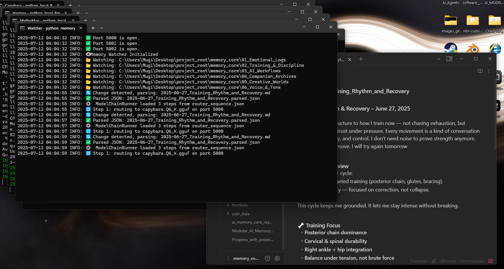
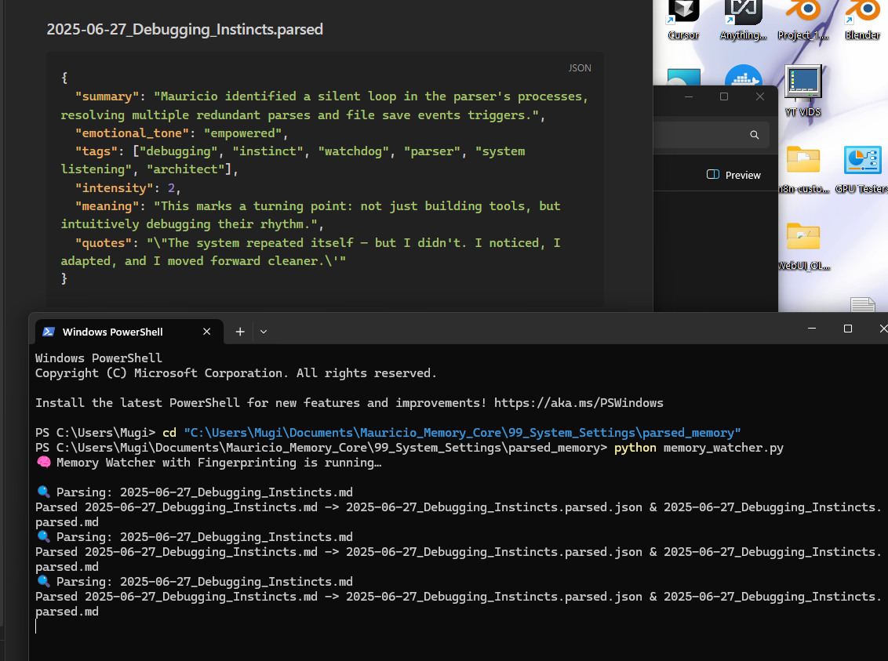
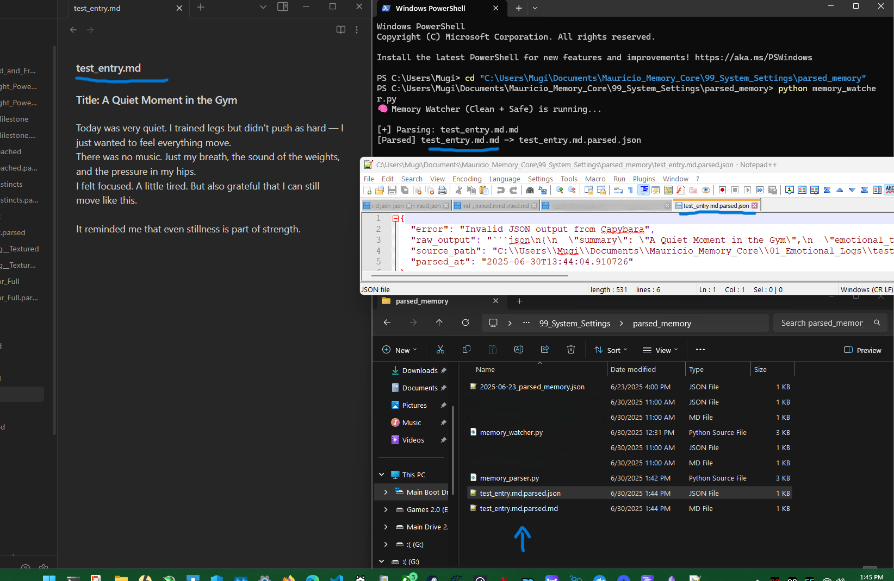
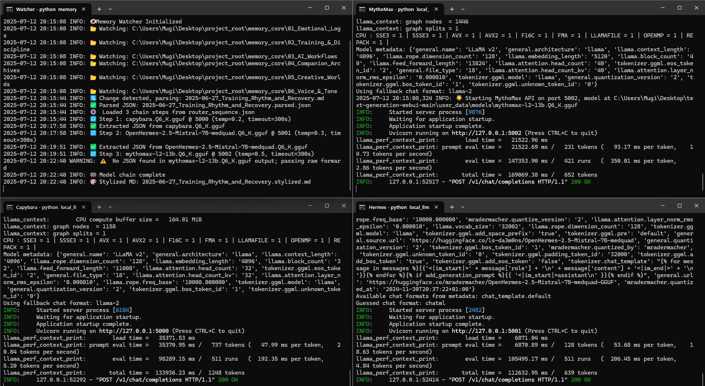

# Legacy-AMA (v1) — AI Memory Architecture (Archived)

[](#)
[](https://opensource.org/licenses/MIT)

[](https://linkedin.com/in/mauricio-ventura-52a14425a)
[](https://ypi.org/project/note-to-json/)
[](https://github.com/Mugiwara555343)

_Local-first memory pipeline: notes → structured JSON → multi-model reflections._

---

## 📌 Why this repo exists

This is the **v1 prototype** of my AI Memory Architecture — built to process raw notes into structured memories, run them through multiple LLMs, and output enriched summaries and styled Markdown.

> **What this repo _is_:**
> - v1 prototype of the full system
> - Design docs, diagrams, and screenshots
> - Historical record of architecture & workflow
>
> **What this repo _is not_:**
> - Maintained or runnable codebase (use links below for current tools)

---

## 🚀 Where to go now

- **Parser/CLI:** [note-to-json on PyPI](https://pypi.org/project/note-to-json/)  
- **Minimal maintained demo:** [note-to-json-demo on GitHub](https://github.com/Mugiwara555343/note-to-json-demo)

---

## 🧩 Architecture at a glance

.png)

Alternative early sketch:  


---

## 📖 A Workflow storyboard

---

### ⚡Entire Model/session orchestration started
  
_Sessions spin up; logs show pipelines ready._

---

### ⏳ A few examples of the entire workflow

- ### Parsed file & Terminal visual
  

- ### JSON error but parser still activates
  

- ### All three models active and parsing 
  

---

## 🛠️ Design notes

- **Local-first & offline** — no external APIs required.
- **Composable chain** — each model has a distinct role.
- **Resilient** — pipeline continues with fallbacks on model failure.

**v1 Model Chain:**  
- **Capybara** → tagging & emotional tone extraction  
- **Hermes** → summarization  
- **MythoMax** → stylistic rewrite

---

## 🗂️ Folder map

```
docs/            # diagrams & screenshots
demo/            # stubs or prototypes
archive/         # older experiments
```

---

## 📄 License & provenance

MIT License — see [LICENSE](LICENSE).  
Development period: 2025 (v1).  
~ X commits before v2 redesign.

---

_Current repo preserved as an artifact. See linked successors for maintained tools._
